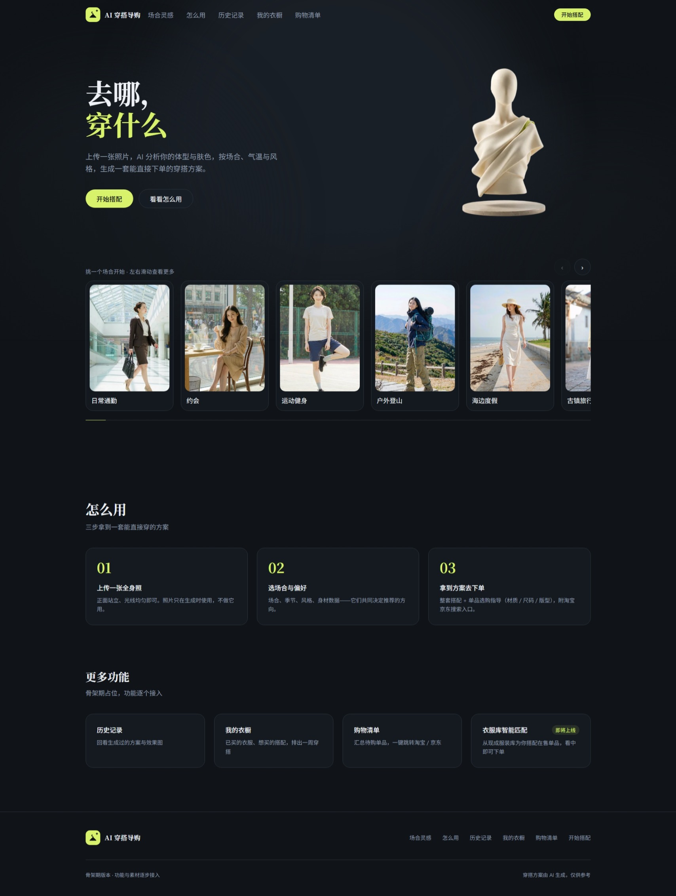
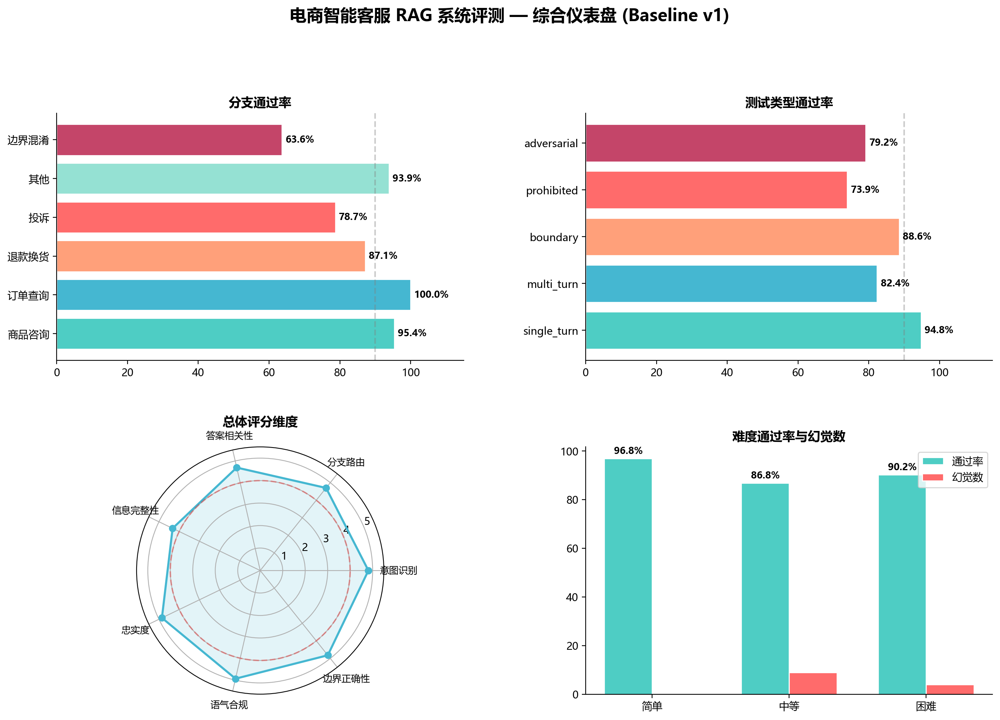

# 👋 Hi, 我是郭超群

**AI 产品经理候选人** · 信息与计算科学专业
用数据驱动替代"拍脑袋"，独立从 0 到 1 完成两个 AI 产品项目。

---

## 📄 我的作品集

> 📄 完整作品集（含界面截图与数据图表）：**[AI 产品经理作品集 · 飞书文档](https://xcnaaqfol96z.feishu.cn/docx/UDmldSWS2oKykaxUrUOcojobnwl)**

**📌 求职方向**：AI 产品经理 / AI 产品运营 / 大模型应用
**📍 城市**：杭州 / 上海 / 长三角 · 亦接受远程
**⏱ 到岗**：可立即到岗 · 全职

---

## 🚀 项目作品集

### 项目一 · AI 穿搭导购系统

> 从 0 到 1 独立打造的 AI 原生穿搭产品。上传照片，AI 分析体型肤色，按场景生成能直接下单的穿搭方案。

- 🎯 **混合架构**：规则保下限（确定性）+ AI 冲上限（创造性）
- 🛒 **完整闭环**：生成方案 → 购物清单 → 效果图轻量赋能（成本≈0.011元/次）
- 🧪 **科学验证**：627 条自动化断言 + 变异测试兜底
- ⚡ **Vibe Coding**：一人全栈，边学边做、实验驱动迭代

→ 查看穿搭项目作品集：[点击访问](https://github.com/guo-chaoqun/ai-stylist-advisor)

---

### 项目二 · 电商智能客服 · RAG 评测体系

> 搭建 505 条评测用例 + LLM Judge 体系，让 AI 客服"可量化、可迭代"。

- 📊 **量化结果**：通过率 91.5% → 97.0%，幻觉率 8.3% → 2.6%
- 🧩 **7 维度评测框架**（意图/路由/相关/完整/忠实/语气/边界）
- 🔁 **复评基准**：同一裁判口径二次验证，过滤评测工具污染
- 🛠 **三层质量门禁**：黄金集回归 + 断言 + 变异测试

→ 查看客服项目仓库：[点击访问](https://github.com/guo-chaoqun/ecommerce-ai-customer-service)

---

## 🧠 我的方法论

- **有评测才有迭代**：任何 AI 产品先搭评测体系再动功能
- **数据驱动决策**：Bad Case 归因 → 修复 → 复评验证 → 再迭代
- **技术选型看阶段**：不是选"最好的"，是选"当前最合适的"（成本/周期/合规三维度）

---

## 📬 联系我

- 邮箱：**168314684@qq.com**
- 求职：AI 产品经理 / AI 产品运营（可立即到岗 · 全职）
- 简历：[简历 PDF · 下载](https://xcnaaqfol96z.feishu.cn/file/Vxogbu9pro26zmxdydWcxugynM0)
- 作品集：[AI 产品经理作品集 · 飞书文档](https://xcnaaqfol96z.feishu.cn/docx/UDmldSWS2oKykaxUrUOcojobnwl)